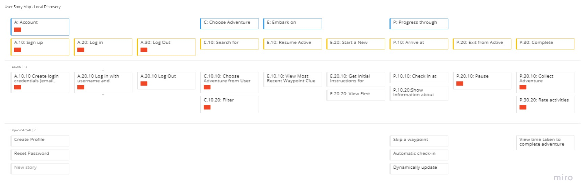

# Local Discovery V2

## Project Outline

Local Discovery is a treasure-hunt style activity trail based on geolocation data, which allows adventurous spirits to discover local attractions in a fun, "gamified" way. 

Local Discovery invites users to embark on any one of a series of curated adventures, and solve clues that lead to different "waypoints" within a given area. Users can check in at each waypoint using their geolocation data to confirm if they're in the right place, and receive their next clue if successful.

Users can leave an adventure at any time, and pick up where they left off when they next load the page. 

## User Story Map

## Technology Used

### Authentication
* [Express Session](https://www.npmjs.com/package/express-session)
* [BCrypt](https://www.npmjs.com/package/bcrypt)

### Server & Deployment
* [Node.js](https://nodejs.org/en/docs/)
* [Heroku](https://devcenter.heroku.com/categories/reference)

### Database
* [MySQL2](https://www.npmjs.com/package/mysql2)

### Templated Structure
* [Tailwind CSS](https://tailwindcss.com/)
* [Handlebars](https://handlebarsjs.com/)
* [JawsDB](https://www.jawsdb.com/docs/)
* [Express](https://www.npmjs.com/package/express)

### API
* [OpenWeather One Call API](https://openweathermap.org/api/one-call-api)
* [Geolocation Web API](https://developer.mozilla.org/en-US/docs/Web/API/Geolocation_API) 

### Other
* [Distance-From](https://www.npmjs.com/package/distance-from)

## Design Notes

* Utilises geolocation web api data to determine a user's position
* Utilises Distance-From NPM package to determine distance between user and a given waypoint
* Determines check-in success based on user's distance from waypoint
* Saves user progress to client-side storage
* Ability to reset adventure progress from adventure start pages
* Interactive (accepts and responds to user input)
* Displays current weather on main page
* Clean and simple card-based user interface
* Mobile-first design

## Links

[Deployed Application](https://local-discovery.herokuapp.com/)

[Github Repository](https://github.com/stephje/local-discovery-v2)

[Video Demonstration](https://youtu.be/5YMzU5p7pjw)

[Presentation Slides](https://1drv.ms/p/s!Aj5LHamJOUb-lW-QZQCn1Ixv45mv?e=OkYkgK)

## Credits and Thanks

[Sunil More](https://stackoverflow.com/users/2741799/sunil-more)
via [Stack Overflow](https://stackoverflow.com/questions/33316562/how-to-compare-a-value-in-handlebars),
for code that was used as a basis for a custom Handlebars helper.

## Screenshots of Deployed Application

### Main Page - Mobile View

<!--  -->
